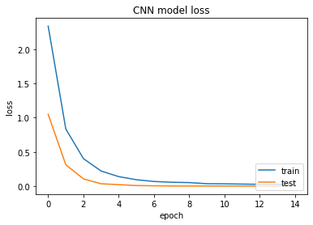
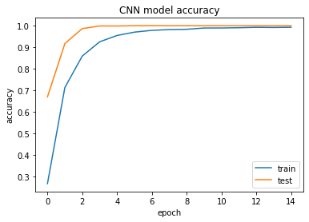

# 🖐️ American Sign Language (ASL) Recognition Project

American Sign Language (ASL) is a visual language that is used by the deaf and hard-of-hearing community in the United States and some parts of Canada. American Sign Language is used as a means of communication for individuals who are deaf or hard-of-hearing. It enables them to express themselves and understand others in a natural, accessible way. It is also used by hearing individuals who work with the deaf and hard-of-hearing community, such as interpreters, teachers, and support staff. The use of ASL has been shown to have social, emotional, and cognitive benefits, and it is a valuable tool for promoting inclusivity and accessibility in society.


---

## 🎯 Main goals

My main goal is to build a machine learning model trained on thousands of images of American Sign Language alphabet signs that can generalize to instances of images of signs never seen by the model. This is because the ultimate goal of this model should be to create a useful model for various types of applications that try to predict the meaning of a letter sign starting from images captured in real-time, allowing us to communicate with deaf or hard-of-hearing individuals.

---

## 🤔 What will I try to do?

In this notebook, I explore different types of models to see which one fits better a sample image dataset for the ASL recognition problem taken from Kaggle. I compare the results obtained to choose the model with the best performance that I will later train on a dataset of **14448 ASL signs images built entirely by me**.  

Considering that we are talking about an image classification task, and since images are composed of pixels, we have a task in which the features of our dataset are the pixels of the images (these latter can be several hundreds or even thousands) leading the models to have very sparse parameters in the space, causing normal Machine Learning models to have poor performance in predicting the correct label of belonging.  

As a result, it is necessary to use more sophisticated **Deep Learning models**, particularly **neural networks** and **convolutional neural networks (CNNs)**. However, I will also implement an **ensemble model**, specifically a **Random Forest**. Since this is a complex problem where the features are many and the parameters are sparse in the space, **Clustering** turns out to be a very poor estimator, so I have avoided implementing it.

---

## 🛠️ What do I need?

**PySpark** is an open-source Python API for Apache Spark, a fast and general-purpose cluster computing system that is used for processing big data. PySpark provides a high-level interface for working with Spark and enables data scientists and engineers to leverage their existing Python skills to interact with Spark data structures and algorithms.  

PySpark is widely used for data analysis, machine learning, and other data-intensive tasks, making it a powerful tool for data engineers, data scientists, and developers.  

However, PySpark natively provides APIs to implement only machine learning models. It does not support Deep Learning models such as neural networks or convolutional neural networks. I had to search for frameworks that would also allow me to work with deep learning algorithms. After deep research of the best framework, I chose to use **Horovod**.

---

## 🚀 What is Horovod? Why is Horovod a good choice? What to install?

**Horovod** is an open source distributed deep learning framework that is designed to support **TensorFlow** and **PyTorch** models. It provides an easy-to-use, scalable and fast solution for distributed deep learning training on multiple GPUs/CPUs and nodes.  

Horovod is a good choice for image classification because it offers the following benefits:  

- ⚡ **Scalability**: Horovod allows you to scale your training across multiple GPUs/CPUs and nodes, making it possible to train large-scale models.  
- ⏩ **Speed**: Horovod can significantly speed up training times by distributing the workload among multiple GPUs/CPUs.  
- 🧩 **Easy to use**: Horovod is designed to be easy to use and integrate into existing deep learning pipelines.  
- 🔗 **Interoperability**: Horovod supports TensorFlow and PyTorch, making it possible to use a variety of models and techniques for image classification.  

Overall, Horovod provides a fast, scalable and easy-to-use solution for distributed deep learning training on multiple GPUs/CPUs, making it an ideal choice for image classification tasks.

---

## 📂 The ASL Dataset and preprocessing

The **Sign Language MNIST dataset** is a replacement for the popular MNIST image dataset of handwritten digits, aimed to provide a more challenging and original benchmark for computer vision and machine learning applications.  

It consists of hand gestures representing the 24 letters of the American Sign Language (excluding **J** and **Z** due to their motion-based gestures) in a format similar to the classic MNIST, with grayscale images of **28x28 pixels**.  

- 📊 **Dataset size**:  
  - Training data: **27,455 cases**  
  - Test data: **7,172 cases**  

Each training and test case represents a label (0-25) as a one-to-one map for each alphabetic letter **A-Z** (excluding **J, Z**).  

The dataset format matches MNIST closely with:

label, pixel1, pixel2, …, pixel784

👉 For more information check the Kaggle dataset [link](https://www.kaggle.com/datasets/datamunge/sign-language-mnist) 

**Data preprocessing** involves:  
- 🧹 **Data cleansing** (removing invalid, incomplete, or irrelevant data)  
- 🔄 **Data transformation** (scaling, normalization, encoding)  
- 🔗 **Data integration** (combining multiple data sources)  
- ✂️ **Data reduction** (eliminating redundant/irrelevant data)  

The goal is to ensure the data is accurate, consistent, and ready for machine learning algorithms.

---

## ⚙️ Scaler, VectorAssembler, StringIndexer and OneHotEncoder for CNN

- **Scaling**: Pixel values are divided by **255** (max grayscale value) to normalize them between `0-1`.  
- **VectorAssembler**: Combines columns into a single vector column.  
- **StringIndexer**: Encodes string labels into numeric indices.  
- **OneHotEncoder**: Transforms category indices into binary vectors for CNN training.  

---

## 🧠 Convolutional Neural Network (CNN)

After preprocessing, the dataset is ready for modeling.  
The **Convolutional Neural Network (CNN)** is the main model, built with layers such as:  

- 🌀 **Convolutional** → learn local features  
- 🔽 **Max Pooling** → down-sample feature maps  
- 💧 **Dropout** → prevent overfitting  
- 🔗 **Dense** → final classification  

CNNs automatically learn relevant features and are highly effective for image classification tasks.  

---

## 🔧 Training strategy

In this notebook, I show the training, validation, and testing of the best models selected after **hyperparameter tuning**.  

- I followed a **try and test strategy** because full **Cross-Validation** would consume too many resources (time and memory).  
- Even limited CV on CNN models caused **memory overflow**.  

So, the chosen strategy balanced performance tuning with available resources.

---

# 🖼️ CNN + Horovod Training

```python
batch_size = 120
nb_classes = 24
epochs = 15

model = Sequential()
model.add(keras.layers.Reshape((28, 28, 1), input_shape=(784,)))
model.add(keras.layers.Conv2D(32, kernel_size=(5,5), activation='relu'))
model.add(keras.layers.MaxPooling2D(pool_size = (2, 2)))

model.add(keras.layers.Conv2D(64, kernel_size = (5, 5), activation = 'relu'))
model.add(keras.layers.MaxPooling2D(pool_size = (2, 2)))
model.add(keras.layers.Dropout(0.20))

model.add(keras.layers.Conv2D(128, kernel_size = (3, 3), activation = 'relu'))
model.add(keras.layers.MaxPooling2D(pool_size = (2, 2)))
model.add(keras.layers.Dropout(0.20))

model.add(keras.layers.Flatten())
model.add(keras.layers.Dense(128, activation = 'relu'))
model.add(keras.layers.Dropout(0.20))
model.add(keras.layers.Dense(nb_classes, activation = 'softmax'))

optimizer = optimizers.Adam(learning_rate=0.001)
loss = 'categorical_crossentropy'

```

This following cell code is creating a Horovod (hvd) estimator for distributed training in Keras that allows us to train directly on Spark Dataframe. We can set several parameters for this estimator:

- **num_proc** specifies the number of processes to run in parallel.  
- **store** is the location of the model file.  
- **model** is the previously defined Keras model.  
- **optimizer** is the optimization algorithm used to update the model weights.  
- **metrics** is a list of metrics to monitor during training and evaluation. It includes 'accuracy', as well as the Precision and Recall metrics.  
- **loss** is the loss function used to evaluate the model performance.  
- **validation** is the percentage of the training data used for validation.  
- **feature_cols** is a list of columns containing the features used for training and prediction.  
- **label_cols** is a list of columns containing the target variable.  
- **batch_size** is the number of samples per gradient update.  
- **epochs** is the number of complete passes over the training data.


```python
keras_estimator = hvd.KerasEstimator(
    num_proc=2,
    store=store,
    model=model,
    optimizer=optimizer,
    metrics=['accuracy', keras.metrics.Precision(), keras.metrics.Recall()],
    loss=loss,
    validation=0.1,
    feature_cols=['scaled_features'],
    label_cols=['label_vec'],
    batch_size=batch_size,
    epochs=epochs
    )

keras_model = keras_estimator.fit(train_df).setOutputCols(['prediction']) # Fit the model

cnn_history = keras_model.getHistory() # Get the metrics hystory

```
Below is the code and related graphs to compute the CNN metrics.

```python
# This is a function to plot the metrics 
def plot_metrics(history):
  for idx, key in enumerate(history):
    if idx >= 4:
      break 
    val_key = 'val_' + key
    plt.plot(history[key])
    plt.plot(history[val_key])
    plt.title('CNN model ' + key)
    plt.ylabel(key)
    plt.xlabel('epoch')
    plt.legend(['train', 'test'], loc='lower right')
    plt.show()
    print()

plot_metrics(cnn_history)

```





# 🌲 Random Forest & Multilayer Perceptron for ASL

Although **Convolutional Neural Networks (CNNs)** are usually the best performing models for **image classification**, I try to test other approaches as well. Below is a summary of **Random Forest** and **Multilayer Perceptron (MLP)** models.

---

## 🌳 Random Forest Classifier (RF)

- A **Random Forest** is an **ensemble** method, combining multiple decision trees to improve robustness and accuracy.  
- Operates by training many decision trees on random subsets of the data.  
- Predictions are combined by:
  - ✅ Voting (for classification)  
  - 📊 Averaging (for regression)  
- Implemented in **PySpark MLlib** and can handle **binary and multi-class classification**.  
- 💡 Idea: leverage strengths of individual trees while reducing weaknesses.

---

## 🧠 Multilayer Perceptron Classifier (MLP)

- An **MLP** is a type of **artificial neural network** for supervised learning tasks.  
- Composed of:
  - Input layer: receives data  
  - Hidden layers: process data through interconnected neurons  
  - Output layer: predicts the class label  
- Connections between neurons have **weights** updated during training based on prediction errors.  
- Common applications: **image recognition**, **speech recognition**, **NLP**.

---

## ⚠️ Important Notes

- Both **Random Forest** and **MLP** show **lower performance compared to CNNs** for this ASL image classification task.  
- ✅ **CNN remains the best model** for this dataset.  
- All **code and detailed results** for RF and MLP can be found **inside the notebook**.

---

# ⏱️ Real-Time Application

- The **saved CNN model** and the **Python program** implementing the real-time application are provided in **two separate files**.  
- 🎥 A **video demo** of the application's execution is included in the drive folder at the [link](https://drive.google.com/file/d/1OEGV7z8TNAxe0lG5piTuwHoZqR1Oa7KM/view?usp=sharing).  

---

## 💡 How to test in real time

- Position your **laptop camera** facing a **well-lit area**.  
- Reason: The application uses **color thresholding**, which depends on color gradations in the image.  
  - ⚠️ Poor or uneven lighting can **reduce the model's prediction accuracy**.  

## ▶️ Run Real-Time Application

To **run the real-time ASL application**, simply execute the Python script:

```bash
python asl_application.py

```
